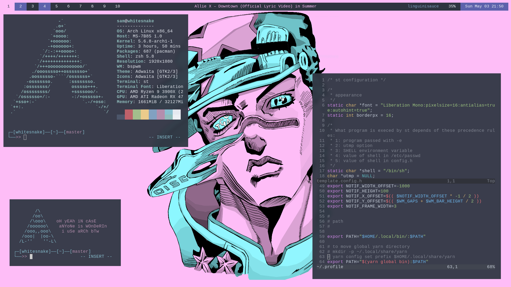

# [BSPWM] Stone Ocean




These are the dotfiles I use regularly in my school laptop and home desktop. I highly recommend against copying these dotfiles blindly unless you know exactly what each file does to your system. Some of the features or packages I use in my system are experimental or built with specific hardware in mind. I take no responsibility for any damages or system failures you may encounter - that being said, if you come across a reproducible issue or would like to ask me questions, feel free to open an issue or contact me privately and I would be more than happy to help.

I also have been working on compatibility with MacOS. While I cannot fix everything to work in MacOS, basic utilities and command-line aliases are compatible. See [cloning](#cloning).

I use to primarily use Wayland and have a setup specifically set up for use with Sway. If you're interested, you can check it out in [this release](https://github.com/bossley9/dotfiles/tree/2020.03.11).

## Table of Contents
1. [System Information](#sysinfo)
2. [Cloning](#cloning)
3. [Manual Installation](#manualinstall)
4. [Additional Configuration](#addconfig)
5. [TODO](#todo)

## System Information <a name="sysinfo"></a>

```
OS: Arch Linux x86_64
Kernel: 5.6.8-arch1-1
Shell: zsh
WM: bspwm
Theme: Nordic [GTK2/3]
Icons: Adwaita [GTK2/3]
Terminal: st
Status Bar: polybar
Launcher: dmenu

Editor: neovim
Browser: brave (with cVim, JSON Formatter, and React Developer Tools extensions)
File Exporer: ranger
System Profiler:  htop
```

## Cloning <a name="cloning"></a>

>There are two routes you can follow to reproduce the exact same setup I have, one being more tedious, but possibly less work in the long run.
>  - If you would like to wipe an entire machine and begin from scratch with my setup, I have outlined a clean Arch installation according to my preferences in [manual installation](#manualinstall). This may be a bit more work but guarantees that the setup will work exactly the same as mine.
>  - If you would like to install the dotfiles on top of an existing OS or setup, you can follow the instructions below to clone my dotfiles into your setup. However, be forewarned - I can't guarantee anything will work. You will likely have to fiddle with the `.xinitrc` and `.profile` files a bit to get everything working properly, and it may cost you a considerable amount of time to get everything to work in the long run.

1. Clone this repository to your home folder. If you followed the [manual installation](#manualinstall), choose `zsh` here.
    - `zsh`:
      ```zsh
      git clone --recursive https://github.com/bossley9/dotfiles.git /tmp/dotfiles
      setopt -s glob_dots
      cp -rv /tmp/dotfiles/* $HOME/
      ```
    - `bash`:
      ```bash
        git clone --recursive https://github.com/bossley9/dotfiles.git /tmp/dotfiles
        shopt -s dotglob nullglob
        cp -rv /tmp/dotfiles/* $HOME/
      ```
2. Install required core packages for the configuration to work, as well as my preferred programs. 
    I've written a script in my dotfiles that installs all necessary packages automatically. 
    This script can be rerun to install any additional packages after an update to this repository, 
    and you can even add your own packages to the files to install them. 
    It will also enable system packages and build my `suckless` utilities.

    **GNU/Linux:**
    ```sh
    source $HOME/.profile
    $HOME/.config/installation/setup.sh
    ```
    Restart and verify all packages are running properly.
    ```
    sudo reboot
    ```
    You may need to install certain packages or run certain commands in order to tweak everything accordingly.
    I've tried to include comments at the top of most relevant config files.

    To apply patches to `suckless` tools, you can download patches from the `suckless` website and
    run the following command, making sure to specify the file being
    changed as `template.config.h` instead of the standard `config.h`.
    ```
    patch --merge -i patchName.diff
    ```
    **MacOS:**
    ```sh
    source $HOME/.profile
    $HOME/.config/installation/macos.sh
    ```
    I generally utilize OSX's default terminal, changing the background to a darker theme.
    In order to use the terminal buffer keymap(s) in `nvim`, make sure to set the `use option as meta key` option in the profile keyboard settings.

## Manual Installation <a name="manualinstall"></a>

For the best personalized Arch installation experience I suggest reading the Arch Wiki. It's surprisingly good and goes into depth about customizing Arch to fit your standards. Note that these settings are all settings I prefer to use and may not fit your specific use case.

Another disclaimer - I am a strong advocate for the `vim` and text editors, and as such, I used `vim` to edit files during installation. If you prefer emacs or nano, I encourage you to use such tools.

#### Table of Contents
1. [Setup](#setup)
2. [Preliminary Internet](#preliminternet)
3. [System Time](#systime)
4. [Disk Partitioning](#diskpartition)
5. [Distro Installation](#distroinstall)
6. [Mounting with Fstab](#fstabmount)
7. [System Network Manager](#networkmanager)
8. [Grub Bootloader](#grubboot)
9. [Password](#password)
10. [Locales and System Information](#locales)
11. [Installation Wrapup](#installwrap)
12. [Wifi](#wifi)
13. [Creating a User](#creatinguser)
14. [Core Packages](#corepackages)

#### Setup <a name="setup"></a>

1. For this guide, you will need the following tools:
    - A computer that can be wiped to install Archlinux
    - An ethernet connection
    - A usb drive that can be wiped
2. Download [Arch](https://www.archlinux.org/download/). I downloaded version `archlinux-2020.05.01-x86_64.iso`.
3. Burn the cd image onto a usb. This can be done using a number of different tools:
    - [Balena Etcher](https://www.balena.io/etcher/)
    - [Rufus](https://rufus.ie/)
    - [Mkusb](https://help.ubuntu.com/community/mkusb)
    - Or, if you prefer command line like me:
      ```
      sudo dd bs=4M if=/path/to/iso of=/dev/sdx status=progress
      ```
      where `/dev/sdx` is the root partition of the usb (do not include specific partition numbers). You may want to run `sudo fdisk -l` first to double check the partition name.
4. Boot the machine from the live usb (you may need to modify BIOS settings to boot from a usb hard drive).

Booting into Arch will bring up a simple command prompt.

#### Preliminary Internet <a name="preliminternet"></a>

1. After verifying the ethernet cable is plugged in, test the internet with `ping archlinux.org`. If internet has not yet been set up on the computer, it will likely provide the following error:
    ```
    ping: archlinux.org: Temporary failure in name resolution
    ```
    (if a response appears, `ctrl-c` to stop the ping and skip ahead to the next section.)
2. Get the names of all network cards with `ip link`. Remember the names of the cards that display. On most machines there are three:
    - `lo` represents a loopback device, which is kind of like a virtual network (this is how we access 127.0.0.1 and other localhost ports).
    - `eth0` represents an ethernet adapter. Usually the interface is given a more specific name, such as `enp0s25`. In this guide I will use `eth0` to represent the ethernet card.
    - If your machine has a wifi card, it will be represented by `wlan0`. Like the ethernet card, this is usually passes under a more specific name, like `wlp1s0`. In this guide I will use `wlan0` to represent the wireless card.
3. This installation will use ethernet to download all packages and setup future internet with ethernet and/or wifi. It is definitely possible to install Archlinux on a computer using the `wifi-menu` command, but I recommend against it because it involves a lot more complication and will be subsequently slower during install. To set up a temporary internet:
    1. Copy the netctl example ethernet configuration.
        ```
        cp /etc/netctl/examples/ethernet-static /etc/netctl
        ```
    2. `vim /etc/netctl/ethernet-static` to change the interface to the interface found earlier.
        ```
        Interface=eth0
        ```
    3. Enable the configuration and reboot.
        ```
        netctl enable ethernet-static
        systemctl stop dhcpcd
        systemctl disable dhcpcd
        sudo reboot
        ```
    4. Verify `ping archlinux.org` produces a response. Do not proceed and repeat this section until a response appears.

#### System Time <a name="systime"></a>

1. Update the system time.
    ```
    timedatectl set-ntp true
    ```

#### Disk Partitioning <a name="diskpartition"></a>
We will be creating a main partition for all files and a swap partition for suspending and hibernation. To view the amount of memory installed in the system, run the `free` command, or the more human-readable `free -g` command. To be safe, we will make the swap partition to be twice the amount of RAM.

1. To view the disks to partition, use `fdisk -l` to display all drives and note the drive you wish to install Arch on. Make sure this drive is not the usb drive. Mine is `/dev/sda`, and as such, I will be using this drive for the purposes of this guide. Run the following command to open the partitioning editor for that disk:
    ```
    fdisk /dev/sda
    ```
2. Delete all partitions on this drive by typing `d` consecutively and selecting existing partitions until it states that no partitions are defined.
3. Type `p` to display the disk size.
3. Type `n` to create a new partition, and `p` to make this a primary partition. Partition number and first sector can both be left at default. You can press `ENTER` to use the default for both of these prompts.
4. This partition will be the swap partition, which will be twice the size of RAM. My system uses 16Gb of RAM, so the partition created will be 2 x 16Gb = 32Gb.
    ```
    +32G
    ```
    Press `ENTER` again to allocate the entire disk for the partition, and `y` to remove any existing signatures.
5. The rest of the space will be used for the main partition. Using the same commands, create a partition which uses the rest of the disk. When prompted for the last sector, type `ENTER` to use the rest of the space.
6. Type `w` to write the changes to the hard drive. You will be able to use `fdisk -l` to view the changes to the disk.
7. Overwrite any existing data and change the partition extensions. In my case, my swap partition is `/dev/sda1` and my root partition is `/dev/sda2`.
    ```
    mkfs.ext4 /dev/sda2
    mkswap /dev/sda1
    swapon /dev/sda1
    ```
8. Mount the created root partition.
    ```
    mount /dev/sda2 /mnt
    ```

#### Distro Installation <a name="distroinstall"></a>

1. Install the linux kernel and base. This will take some time to complete. It is also recommended to install `base-devel` development tools and an editor like `vim`.
    ```
    pacstrap /mnt base base-devel linux linux-firmware vim
    ```

#### Mounting with Fstab <a name="fstabmount"></a>

`fstab` is used to mount drives to the system.

1. Generate an `fstab` file.
    ```
    genfstab -U /mnt >> /mnt/etc/fstab
    ```
2. Then log into the system.
    ```
    arch-chroot /mnt
    ```

#### System Network Manager <a name="networkmanager"></a>

1. Install `networkmanager`.
    ```
    pacman -S networkmanager
    ```
2. Enable `networkmanager` on boot.
    ```
    systemctl enable NetworkManager
    ```

#### Grub Bootloader <a name="grubboot"></a>

1. Install `grub`.
    ```
    pacman -S grub
    grub-install --target=i386-pc /dev/sda
    ```
2. Generate the `grub` configuration.
    ```
    grub-mkconfig -o /boot/grub/grub.cfg
    ```

#### Password <a name="password"></a>

1. Set a password for the root user.
    ```
    passwd
    ```

#### Locales and System Information <a name="locales"></a>

1. `vim /etc/locale.gen` to enable locales.
    ```
    en_US.UTF-8 UTF-8
    en_US ISO-8859-1
    ```
2. Then generate locales.
    ```
    locale-gen
    ```
3. `vim /etc/locale.conf` to set the system language.
    ```
    LANG=en_US.UTF-8
    ```
4. Synchronize the local time and hardware clock, where [region] is your region and [city] is your city:
    ``` 
    ln -sf /usr/share/zoneinfo/[region]/[city] /etc/localtime
    hwclock --systohc
    ```
5. `vim /etc/hostname` to name the machine. I named mine `diobrando` (for no reason whatsoever).
    ```
    diobrando
    ```
6. Then update `/etc/hosts` accordingly:
    ```
    127.0.0.1 localhost
    ::1 localhost
    127.0.1.1 diobrando.localdomain diobrando 
    ```

#### Installation Wrapup <a name="installwrap"></a>

1. Exit, unmount the filesystem, and shutdown. Safely remove the usb after the machine is powered off.
    ```
    exit
    umount -R /mnt
    shutdown -h now
    ```
2. Unplug the usb and power on the machine. It should boot immediately into the Arch login. Then log in as the root user. If not, repeat the previous steps to install Arch.

#### Wifi <a name="wifi"></a>

1. A wifi network connection can be set up from the command line temporarily if needed. Run `nmcli d wifi list` to display all networks. Then connect with the appropriate SSID and password.
    ```
    nmcli d wifi connect SSID password PASSWORD
    ```
    The current network status can be displayed with the `nmcli radio` and `nmcli device` commands.

#### Creating a User <a name="creatinguser"></a>

1. Create a user. This is the user you will use to log in. I will create a user named `sam`.
    ```
    useradd -m -g wheel sam
    passwd sam
    ```
2. `EDITOR=vim visudo` to grant the new user sudo permissions.
    ```
    %wheel ALL=(ALL) ALL 
    ```
3. Log out and log back in as the user.
    ```
    exit
    ```

#### Core Packages <a name="corepackages"></a>

1. Install a system upgrade. It's good to do this on a clean install. Additionally, install useful package helper like `git` and `yay`.
    ```
    sudo pacman -Syyuu
    sudo pacman -S git

    git clone https://aur.archlinux.org/yay.git /tmp/yay
    cd /tmp/yay && makepkg -si
    ```
2. Install `zsh`.
    ```
    sudo pacman -S zsh
    chsh -s /bin/zsh
    ```
3. Install `X` server packages.
    ```
    sudo pacman -S xorg-xinit xorg-server
    ```
4. (Optional) If you choose to not use `st` as a terminal emulator, make sure you install one and change the `TERM` environment variable located in `.profile` and update the binding in `sxhkdrc`.
5. Log out and log back in, then install my dotfiles. See [cloning](#cloning) for more details.
    ```
    exit
    ```
    If prompted to create a `zsh` startup file, you can press `q` to quit and do nothing. My dotfiles contain necessary `zsh` startup files.

## Additional Configuration <a name="addconfig"></a>

#### Mirrorlist
Sometimes downloading and installing packages takes longer than necessary because the package manager is looking through outdated (out of sync) mirrors or geographically far away ones. While there are many ways to organize the order in which mirrors are tried, I usually use `Reflector` because it is fast and works very well.
```
sudo pacman -S reflector
sudo reflector --latest 50 --sort rate --save /etc/pacman.d/mirrorlist
```
See the [Reflector site](https://xyne.archlinux.ca/projects/reflector/) for additional options and fine-tuning settings.

#### Touchpad settings
By default, most linux distros disable natural scrolling and disable touchpad tapping. I personally find this very irritating. To change touchpad settings, `sudo vim /etc/X11/xorg.conf.d/30-touchpad.conf` and add the following configuration:
```
Section "InputClass"
	Identifier "touchpad"
	Driver "libinput"
	MatchIsTouchpad "on"
	Option "Tapping" "on"
	Option "NaturalScrolling" "true"
EndSection
```
Then reboot to verify changes.

#### Disabling the grub menu
If, like me, you don't plan on dual-booting or adding boot entries, you can disable the grub selection menu with `sudo vim /etc/default/grub`:
```
GRUB_TIMEOUT=0
```
Update the grub, then reboot.
```
sudo grub-mkconfig -o /boot/grub/grub.cfg
sudo reboot
```

#### DaVinci Resolve
`DaVinci Resolve` can be quite cumbersome to get working on a Linux system, especially for one using an AMD gpu. These are the steps I took to install it on my machine, being very particular on drivers.
```
sudo pacman -S xf86-video-amdgpu vulkan-radeon libva-mesa-driver
yay -S amdgpu-pro-libgl opencl-amd
sudo reboot
--------------------------------------------
yay -S davinci-resolve
```
It's also important that the free version that comes with Linux does not have mp3/4 or h.264 support.
I have a simple shell function written in `.config/aliasrc` which converts to the right codecs.

#### Gaming

> With these settings, I have been able to play every game I've tried.
> I use the following hardware components:
> - CPU: AMD Ryzen 9 3900x
> - GPU: AMD Radeon RX 580
>
> I specifically chose AMD products for my build since all Nvidia
> drivers are proprietary and I strongly advocate for open source 
> software. Sorry, no RTX. But I think it's best in the long run.

A lot of gaming applications (such as the Steam client and Wine client) are 32-bit architecture and 
require the `multilib` repository to be enabled. To enable, `sudo vim /etc/pacman.conf` and uncomment
the following section:
```
[multilib]
Include = /etc/pacman.d/mirrorlist
```
Then upgrade the system.
```
sudo pacman -Syu
```
You will also need to install the following packages. Many of these are essential for running games of any kind.
```
sudo pacman -S wine-staging giflib lib32-giflib libpng lib32-libpng libldap lib32-libldap gnutls lib32-gnutls mpg123 lib32-mpg123 openal lib32-openal v4l-utils lib32-v4l-utils libpulse lib32-libpulse libgpg-error lib32-libgpg-error alsa-plugins lib32-alsa-plugins alsa-lib lib32-alsa-lib libjpeg-turbo lib32-libjpeg-turbo sqlite lib32-sqlite libxcomposite lib32-libxcomposite libxinerama lib32-libgcrypt libgcrypt lib32-libxinerama ncurses lib32-ncurses opencl-icd-loader lib32-opencl-icd-loader libxslt lib32-libxslt libva lib32-libva gtk3 lib32-gtk3 gst-plugins-base-libs lib32-gst-plugins-base-libs vulkan-icd-loader lib32-vulkan-icd-loader
```
[Lutris also recommended that I install drivers specific to my GPU](https://github.com/lutris/lutris/wiki/Installing-drivers).

#### Login

The default login prompt is generic and simple. If you would like to modify it, you can use different X-run interfaces to beautify the login prompt. I aim for minimalism, and think that any X server running before a user logs in is unnecessary. As an alternative, you can edit the `/etc/issue` file to modify what is displayed on the login prompt. In my setup, I use `figlet` to create a fancy hostname title on the login prompt.
```
yay -S --needed figlet
echo "$(cat /etc/hostname | figlet -k)" | { sed 's/\\/\\\\/g'; echo "(\l) \\s \\\r\n" } | sudo tee /etc/issue > /dev/null
```

#### WebGL in Brave
Using Brave in Linux with an AMD card disabled my WebGL, even if it was physically possible for Brave to use WebGL.
To enable Brave to use WebGL, navigate to `brave://flags/` and `enable` the `override software rendering list`
option.

## TODO <a name="todo"></a>

Below are a list of things in no particular order that I plan to do but haven't yet implemented or had the time to configure.

+ dmenu pinyin input
+ consider removing liberation mono
+ default applications with `mimeo`
