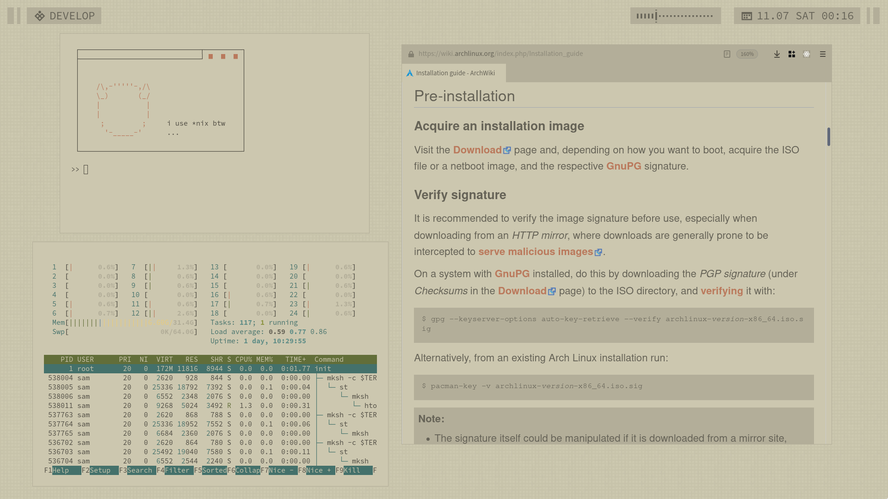
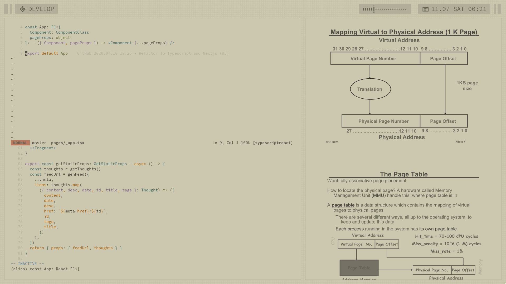
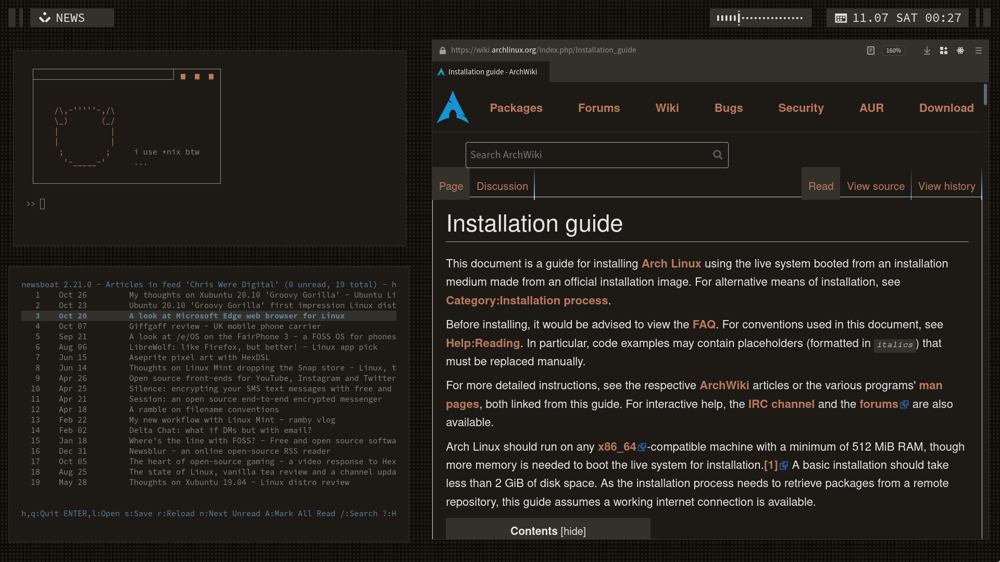

# dotfiles

## Table of Contents
1. [What The \**** Are Dotfiles?](#what-are-dotfiles)
2. [Demonstration](#demonstration)
3. [System Information](#sysinfo)
4. [Manual Installation](#manual-installation)
5. [Additional Configuration or Notes](#addconfig)
6. [TODO](#todo)

## What The \**** Are Dotfiles? <a name="what-are-dotfiles"></a>
According to Quora, dotfiles are _"text-based configuration files that store settings of 
almost every application, service and tool running on your system."_

Essentially, the point of dotfiles is to have a centralized place to store all of your 
application, OS, and system settings. This becomes especially useful when you switch between 
one or two machines regularly (which I am forced to do via work and school). This is also 
useful if you made changes that broke applications and you would like to revert changes.

This introduces the concept of _ricing_, or optimizing a system for greater efficiency and
visual appeal. All too often, I see my fellow engineers struggle to navigate their machine
applications and interface quickly, which slows development and productivity. One of the most
essential parts of being able to use a machine or device effectively is tweaking and 
customizing the machine interfaces, keybindings, and programs to your needs.

In my case, I keep a regular maintenance of these dotfiles in hopes that other people will 
find use from my scripts and struggles to create an aesthetic and fully optimized system. 
I use these same dotfiles for both work and school.

#### Why Linux?

_(I plan on expanding this section in the future.)_

I wanted a solution that protected my privacy from the major tech corporations (**cough cough
Google Microsoft Apple**) while also providing wonderful shell tools like Unix's 
[9base](https://tools.suckless.org/9base/)
utilities. Using Linux also gives me the opportunity to optimize my system to max efficiency,
creating truly custom keybindings for every application, and freely tweak visual appearances
for my own satisfaction (e.g. I guarantee it's extremely hard to add a transparent dual-kawese
blur to all applications on Windows or MacOS).

Am I completely sold on Linux?

No.

While Linux is free and open-source, I want to switch to using even more optimized systems
such as the BSD family of systems. I plan to move in this direction and convert all my
scripts to be POSIX-compliant, but it will likely be a few months before this shift
happens (especially since I'm still attending school).

> EDIT: Regardless of my student status, I am still actively seeking to convert all my
> scripts over. Stay tuned :3

#### Reproducing this setup

I highly recommend against copying these dotfiles blindly unless you know exactly what each 
file does to your system. Some of the features or packages I use in my system are 
experimental, or built with specific hardware in mind. I take no responsibility for any 
damages or system failures you may encounter - that being said, if you come across a 
reproducible issue or would like to ask me questions, feel free to open an issue or contact 
me privately and I would be more than happy to help.

There are two routes you can follow to reproduce the exact same setup I have, one being more 
 tedious, but possibly less work in the long run.
  - If you would like to wipe an entire machine and begin from scratch with my setup, I have 
     outlined a clean installation according to my preferences in 
     [manual installation](#manual-installation). This may be a bit more work but guarantees that 
     the setup will work exactly the same as mine.
  - If you would like to install the dotfiles on top of an existing OS or setup, you can 
     follow the instructions below to clone my dotfiles into your setup. However, be 
     forewarned - I can't guarantee anything will work. You will likely have to fiddle with 
     the `.xinitrc` and `.profile` files a bit to get everything working properly, and it 
     may cost you a considerable amount of time to get everything to work in the long run.

## Demonstration <a name="demonstration"></a>






## System Information <a name="sysinfo"></a>
Information taken from `neofetch` output.
```
OS: Arch Linux x86_64
Kernel: 5.9.3-arch1-1
Shell: mksh
WM: bspwm
Theme: custom [GTK2/3]
Icons: Adwaita [GTK2/3]
Terminal: st
Status Bar: lemonbar-xft
Launcher: fzf

Editor: neovim
Browser: firefox
File Exporer: vifm
Notifications: herbe
System Profiler:  htop
```

## Manual Installation <a name="manual-installation"></a>
This section serves to aid those who would like to fully replicate my current working system
_including_ operating system, packages, and software/architecture specifics.

If you are new to Unix systems, dotfiles, shells, scripting, and systems, I
highly recommend installing and following the
[official Archlinux installation guide](https://wiki.archlinux.org/index.php/Installation_guide)
instead of this one. This installation is more geared towards Unix regulars and
minimalistic power-users looking for a fully customizeable/extendable system that is
POSIX-compliant and follows the
[Unix philosophy](https://en.wikipedia.org/wiki/Unix_philosophy).
I do not necessarily recommend people to follow this section since it's mostly just here
for my own benefit, but it may be helpful to some Unix users.

In other words: _if you're new to the non-proprietary Unix utopia, this installation is
probably not for you._

#### Table of Contents
- [Setup](#setup)
- [Boot Start](#boot-start)
- [Internet](#internet)
- [Update the System Clock](#update-the-system-clock)
- [Disk Partitioning](#disk-partitioning)
- [Operating System Installation](#operating-system-installation)
- [Fstab](#fstab)
- [Chroot](#chroot)
- [Localization](#localization)
- [Network Configuration](#network-configuration)
- [Initramfs](#initramfs)
- [Password](#password)
- [Boot Loader](#boot-loader)
- [Installation Wrapup](#installation-wrapup)
- [Post-Install Internet](#post-install-internet)
- [Creating a User](#creating-a-user)
- [Core](#core)
- [Cloning](#cloning)

#### Setup <a name="setup"></a>
1. For this guide you will need the following tools:
    - The computer that will be wiped to install the new operating system
    - An internet connection
    - A disposable usb drive that can be wiped
2. Download the latest [Archlinux installation image](https://www.archlinux.org/download/)
  from their website. I downloaded version `2020.11.01`.
3. Burn the downloaded disk image onto the usb.
  This can be done using a number of different tools:
  - [Balena Etcher](https://www.balena.io/etcher) (cross-platform)
  - [Rufus](https://rufus.ie) (Windows)
  - [Mkusb](https://help.ubuntu.com/community/mkusb) (Linux/Ubuntu)
  - Or, if you prefer command line like me:
    ```
    sudo dd bs=4M if=/path/to/img of=/dev/sdx status=progress
    ```
    where `/dev/sdx` is the root partition of the usb (do not include specific partition
    numbers). You may want to run `sudo fdisk -l` or `geom disk list`
    (depending on your operating system).
    first to double check the partition name.
4. Boot the computer from the live usb. This may require manual BIOS tweaking depending
  on your machine. Be sure to boot with UEFI if you plan on dual booting with Windows
  in the future.

#### Boot Start <a name="boot-start"></a>
The boot process should eventually land on a virtual terminal prompt.
- Verify the boot mode is UEFI by the output of `ls /sys/firmware/efi/efivars`.

#### Internet <a name="internet"></a>
- You can test for internet with the following command:
  ```
  ping archlinux.org
  ```
  If an internet connection has already been established, you will see an incremental
  output of packets. If not, a DNS error will return.
  ```
  ping: archlinux.org: Name or service not known
  ```
  Type `ctrl+c` to stop the program. If an internet connection has been established,
  you can skip ahead to the next step.
- Assuming no internet connection exists, use `ip link` to retrieve the names of all
  network cards. Remember the names of the cards that display.
  On most machines there are at least three types of network cards:

  - `lo` represents a loopback device, which is kind of like a virtual network
    (this is how 127.0.0.1 and other localhost ports are accessed).
  - `eth0` represents an ethernet (wired) network card. Usually the interface is given a
    more specific name, such as `enp34s0`.
  - `wlan0` represents a wireless network card. As with the ethernet card, this is
    usually passes under a more specific name, like `wlp1s0`. In this guide I use
    wlan0 to represent the wireless card name.

- Establish an internet connection to download all base operating system packages.
  - Ethernet:
    - Copy the netctl example ethernet configuration.
      ```sh
      cp /etc/netctl/examples/ethernet-static /etc/netctl
      ```
    - `vim /etc/netctl/ethernet-static` to change the name of the interface card to
      the name of your network card.
      ```
      Interface=eth0
      ```
    - Enable the configuration and reboot.
      ```sh
      netctl enable ethernet-static
      systemctl stop dhcpcd
      systemctl disable dhcpcd
      sudo reboot
      ```
    - Verify `ping archlinux.org` produces a response. Do not proceed and repeat this
        section until a response appears.
  - Wireless:
    - Enter the iwctl prompt.
      ```sh
      iwctl
      ```
    - Verify the computer's wifi card. This should display the wifi card(s) you saw
      earlier with ip link.
      ```
      device list
      ```
    - Scan for local networks. This command does not display any output and instead
      silently scans.
      ``` 
      station wlan0 scan
      ```
    - List all scanned networks.
      ```
      station wlan0 get-networks
      ```
    - Connect to an internet network, where SSID is the name of the network.
      This will prompt for a password if required.
      ```
      station wlan0 connect SSID
      ```
    - Type `exit` to return to the original terminal prompt.
    - Verify `ping archlinux.org` produces a response. Do not proceed and repeat this
      section until a response appears.

#### Update the System Clock <a name="update-the-system-clock"></a>
- Update the system clock.
  ```
  timedatectl set-ntp true
  ```

#### Disk Partitioning <a name="disk-partitioning"></a>
In this guide I assume that you only want to install to one disk, and that the full
disk is being utilized. I will also be using `ext4` for my filesystem (yes, I've heard
all about the
[wonders of root-on-ZFS](https://www.freebsd.org/doc/en_US.ISO8859-1/books/handbook/zfs.html#zfs-differences)
and I've actually used it with my BSD build, but sadly, Archlinux doesn't quite support
it yet). I'm also assuming you have _at least_ 128 GB of disk space.

My parition scheme will be as follows:
```
/efi - 200 MB
[SWAP] - 2 * RAM
/ - 8 GB
/tmp - 1 GB
/usr - 60 GB
/var - 4 GB
/home - Remainder of space
```
This scheme is to provide the utmost security, modularity, and performance
for a personal computer. The separate partitions prevents system corruptions and allows
end-users to easily swap operating systems without affecting home files.
Additionally, it provides options for UEFI as well as tmpfs.

- Determine the size of the disk and the size of RAM memory.
  I will be using and referencing `/dev/sda` as my disk.
  ```
  # disk partition and size
  fdisk -l

  # memory
  free -h
  ```
- Use `fdisk /dev/sda` to enter a command-line disk partition editor.
  In this prompt you may type `p` to view the pending partition table.
- Type `g` to create a new GPT partition scheme. This will also erase the old partition
  table along with any old partitions.
- Create an efi `/efi` partition. Type `n` to create a new partition, press `enter` to use the
  default partition number and first sector, and make the partition size 200 MB.
  ```
  n
  enter
  enter
  +200M
  ```
  If prompted to remove an existing filesystem signature, say `yes`.
  New signatures will be established for the new partitions.

  Additionally, if you accidentally create a bad partition, you can always delete
  the partition using the `d` key.
- Create a SWAP partition. The partition size should be twice the size of your RAM
  capacity. My RAM is 15 GB:
  ```
  n
  enter
  enter
  +30G
  ```
- Create a root `/` partition.
  ```
  n
  enter
  enter
  +8G
  ```
- Create a `/tmp` partition.
  ```
  n
  enter
  enter
  +1G
  ```
- Create a `/usr` partition.
  ```
  n
  enter
  enter
  +60G
  ```
- Create a `/var` partition.
  ```
  n
  enter
  enter
  +4G
  ```
- Create a `/home` home partition. This partition will use the remainder of the disk space.
  ```
  n
  enter
  enter
  enter
  ```
- Type `p` to view your partitions. Once you are satisfied with your partitioning, type
  `w` to permanently write the partitioning scheme to the disk. You will be returned to
  the virtual terminal prompt, where you will be able to run `fdisk -l` to view your
  newly created partitions.
- Change all partition signatures.
  ```
  mkfs.fat -F32 /dev/sda1

  mkswap /dev/sda2
  swapon /dev/sda2

  mkfs.ext4 /dev/sda3
  mkfs.ext4 /dev/sda4
  mkfs.ext4 /dev/sda5
  mkfs.ext4 /dev/sda6
  mkfs.ext4 /dev/sda7
  ```
- Mount the partitions.
  ```
  mount /dev/sda3 /mnt

  mkdir /mnt/efi
  mount /dev/sda1 /mnt/efi

  mkdir /mnt/tmp
  mount /dev/sda4 /mnt/tmp -o nodev,nosuid,noexec

  mkdir /mnt/usr
  mount /dev/sda5 /mnt/usr

  mkdir /mnt/var
  mount /dev/sda6 /mnt/var

  mkdir /mnt/home
  mount /dev/sda7 /mnt/home -o nodev
  ```
  You can use the `mount` command to verify that your partitions have been mounted correctly.

#### Operating System Installation <a name="operating-system-installation"></a>
- Install the Linux kernel and Archlinux base. This usually takes some time to
  complete depending on your internet stability. I also recommend installing a
  text editor (`vim`).
  ```
  pacstrap /mnt base base-devel linux linux-firmware vim
  ```

#### Fstab <a name="fstab"></a>
- Generate an Fstab file. This is a file that dictates how partitions are mounted
  when the system boots.
  ```
  genfstab -U /mnt >> /mnt/etc/fstab
  ```
  You can double check that `/mnt/etc/fstab` is formatted according to your needs
  and modify any mount options if needed.

#### Chroot <a name="chroot"></a>
- Change root into the new system. You will now be within your newly-formatted disk.
  ```
  arch-chroot /mnt
  ```

#### Localization <a name="localization"></a>
- Set the time zone, where REGION and CITY pertain to your local area.
  These values can be tab-completed.
  ```
  ln -sf /usr/share/zoneinfo/REGION/CITY /etc/localtime
  ```
- Sync the clock to the time zone specified.
  ```
  hwclock --systohc
  ```
- `vim /etc/locale.gen` to enable necessary locales. I use English as my system language,
  but yours may differ:
  ```
  en_US.UTF-8 UTF-8
  ```
  Then generate locales.
  ```
  locale-gen
  ```
- `vim /etc/locale.conf` to set the system language:
  ```
  LANG=en_US.UTF-8
  ```

#### Network Configuration <a name="network-configuration"></a>
- Name your system in `/etc/hostname`. I will name mine `automata`.
  ```
  automata
  ```
- Create the corresponding host entries in `/etc/hosts`:
  ```
  127.0.0.1     localhost
  ::1           localhost
  127.0.1.1     automata.localdomain    automata
  ```
- Install a network manager. I use `NetworkManager`:
  ```
  pacman -S networkmanager
  systemctl enable NetworkManager
  ```

#### Initramfs <a name="initramfs"></a>
In order to allow the system to detect the `/usr` drive, we need to add init flags.
- `vim /etc/mkinitcpio.conf` and add the following hooks, not altering the previous hooks:
  ```
  HOOKS=(... shutdown usr fsck)
  ```
  Then recreate the ramfs image:
  ```
  mkinitcpio -P
  ```

#### Password <a name="password"></a>
- Set the root password.
  ```
  passwd
  ```

#### Boot Loader <a name="boot-loader"></a>
I use Grub as a bootloader because it is simple, quick, and works on both UEFI/BIOS systems. It also has a customizeable appearance.

- Install GRUB and efibootmgr for UEFI.
  ```
  pacman -S grub efibootmgr
  grub-install --target=x86_64-efi --efi-directory=/efi --bootloader-id=GRUB
  ```
- Generate the GRUB configuration file.
  ```
  grub-mkconfig -o /boot/grub/grub.cfg
  ```

#### Installation Wrapup <a name="installation-wrapup"></a>
At this point, we have completely installed everything needed for a fully functional
Archlinux system.
- Exit chroot and umount the partitions.
  ```
  exit
  umount -R /mnt
  ```
- Shutdown the system.
  ```
  shutdown -h now
  ```
  Then safely remove the usb drive.
- Power on the machine. You likely need to change the BIOS/UEFI settings of your machine
  in order to tell your motherboard the location of the efi boot partition.

  If it boots into a GRUB menu, then stops at a login prompt, you've just successfully
  completed a standard Archlinux installation! However, this specific installation is
  anything but standard - we still have some work to do.
- Log in to root using `root` as the username and the password you created earlier.

#### Post-Install Internet <a name="post-install-internet"></a>
- Connect to internet with Network Manager. This can be done via the command line interface
`nmcli`, or the easier terminal interface `nmtui`.
- Verify internet connection with `ping archlinux.org`.

#### Creating a User <a name="creating-a-user"></a>
- Create a new user. This will be the main user in which you will use to log into and
  interact with your system.
  ```
  useradd -m -g wheel sam
  passwd sam
  ```
- Use `EDITOR=vim visudo` to grant the new user root permissions.
  ```
  %wheel ALL=(ALL) ALL
  ```
  Then logout and log back in as the newly created user.

#### Core <a name="core"></a>
- First, run a system upgrade to update any packages that were not up to date when the
  system was installed. It's a good practice to do this on a clean install even if no
  packages need updating.
  ```
  sudo pacman -Syu
  ```
- Install git.
  ```
  sudo pacman -S git
  ```
- Install any core utilities.
  ```
  sudo pacman -S bc
  ```
- Install and set mksh as the default shell.
  ```
  sudo pacman -S mksh
  chsh -s /bin/mksh
  ```
  Log out and log back in to use the new default shell.

#### Cloning <a name="cloning"></a>
- Clone this repository to your home folder using the steps outlined below.
  If you have followed my [manual installation](#manual-installation) completely,
  choose `mksh`.
  - dash/mksh/sh:
    ```sh
    cd $HOME
    # this action is irreversible - be careful!
    rm -rf .*
    git clone --recursive https://github.com/bossley9/dotfiles.git .
    ```
  - bash:
    ```sh
    git clone --recursive https://github.com/bossley9/dotfiles.git /tmp/dotfiles
    shopt -s dotglob nullglob
    cp -rv /tmp/dotfiles/* $HOME/
    ```
  - zsh:
    ```sh
    git clone --recursive https://github.com/bossley9/dotfiles.git /tmp/dotfiles
    setopt -s glob_dots
    cp -rv /tmp/dotfiles/* $HOME/
    ```
- Log out and log back in.
  ```
  exit
  ```
- Run the install script I have created:
  ```sh
  $XDG_CONFIG_HOME/install/arch.sh
  ```
- Reboot to allow changes to take effect.
  ```
  reboot
  ```

## Additional Configuration or Notes <a name="addconfig"></a>
This list of additional optional configuration options are in no particular order.
I've just added or modified them when necessary.

- [Gaming](#gaming)

#### Gaming <a name="gaming"></a>
With these settings, I have been able to play every game I've tried.
> I use the following hardware components:
> - CPU: AMD Ryzen 9 3900x
> - GPU: AMD Radeon RX 580
>
> I specifically chose AMD products for my build since all Nvidia
> drivers are proprietary and I strongly advocate for open source 
> software. Sorry, no RTX. But I think it's best in the long run.

A lot of gaming applications (such as the Steam client and Wine client) are 32-bit 
architecture and require the `multilib` repository to be enabled. To enable, 
`sudo nvim /etc/pacman.conf` and uncomment the following section:
```
[multilib]
Include = /etc/pacman.d/mirrorlist
```
Then upgrade the system.
```
sudo pacman -Syu
```
You will also need to install the following packages. Many of these are essential for running 
games of any kind.
```
sudo pacman -S wine-staging giflib lib32-giflib libpng lib32-libpng libldap lib32-libldap gnutls lib32-gnutls mpg123 lib32-mpg123 openal lib32-openal v4l-utils lib32-v4l-utils libpulse lib32-libpulse libgpg-error lib32-libgpg-error alsa-plugins lib32-alsa-plugins alsa-lib lib32-alsa-lib libjpeg-turbo lib32-libjpeg-turbo sqlite lib32-sqlite libxcomposite lib32-libxcomposite libxinerama lib32-libgcrypt libgcrypt lib32-libxinerama ncurses lib32-ncurses opencl-icd-loader lib32-opencl-icd-loader libxslt lib32-libxslt libva lib32-libva gtk3 lib32-gtk3 gst-plugins-base-libs lib32-gst-plugins-base-libs vulkan-icd-loader lib32-vulkan-icd-loader
```
[Lutris also recommended that I install drivers specific to my GPU](https://github.com/lutris/docs/blob/master/InstallingDrivers.md).

## TODO <a name="todo"></a>
Below are a list of things in no particular order that I plan to do but haven't yet
implemented or had the time to configure.

+ [pinyin input (fcitx?)](https://forums.freebsd.org/threads/installing-chinese-input-method-in-freebsd-10-1.52314/)
+ fix pulse sound switching (idek what's wrong but it's buggy) and needs to be OSS/ALSA compatible
  + fix ffmpeg screen capture quality and audio
  + fix context switching in ALSA (via events (evtest) or manually (dbus or something))
+ contact management application (abook?)
+ Remove mouse cursor from screen script
+ Switch to terminal email (Mutt?)
+ update readme (yes, this file) with actually updated info
+ vim keybindings for alsamixer
+ vim keybindings extension for firefox
+ reconfigure nvim (error suppression and cleaner plugins)
+ Fix mpd startup errors
+ add screen magnifier
+ todo list on desktop
