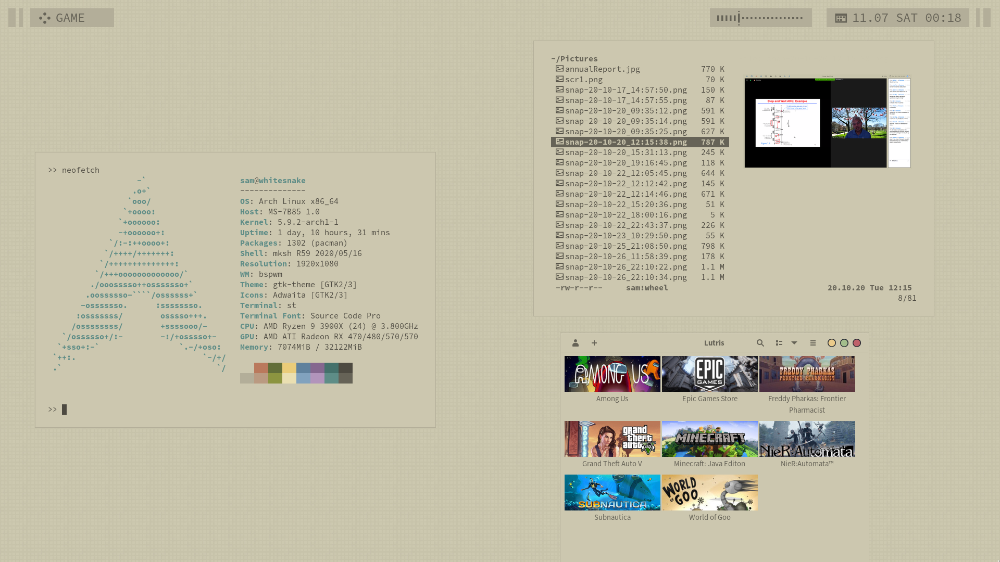
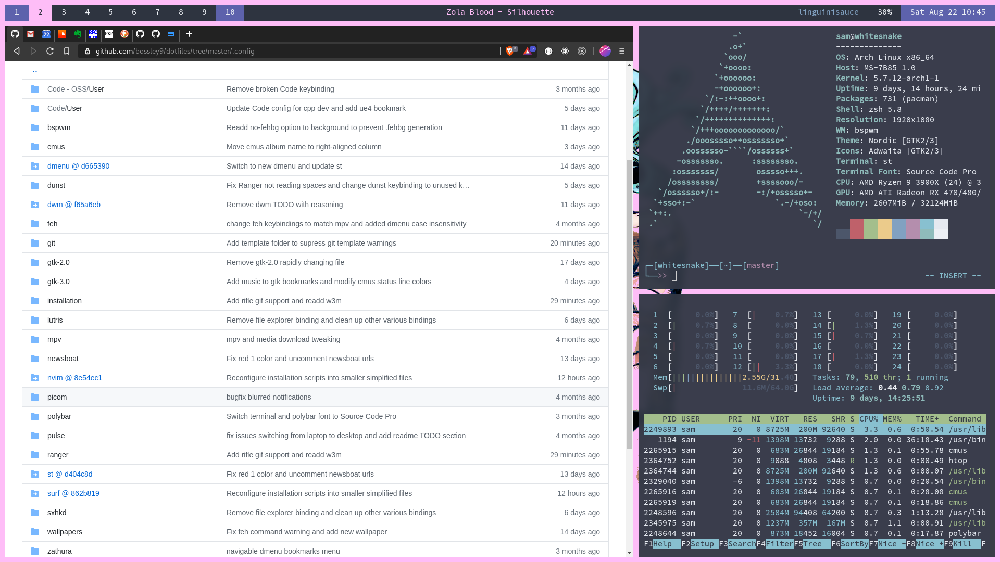
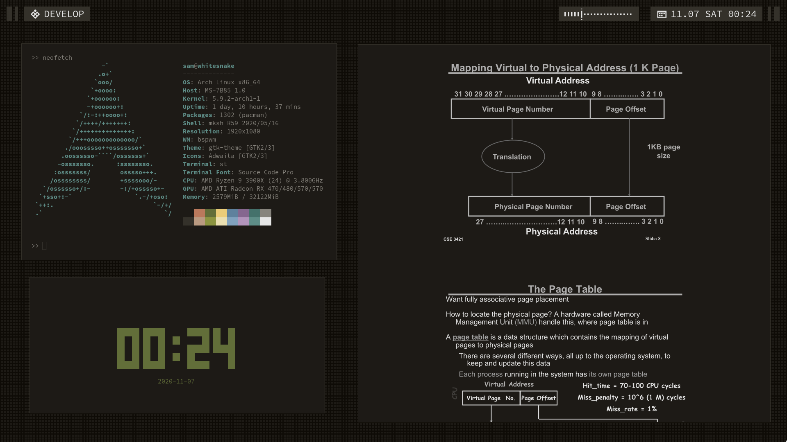

# dotfiles

## Table of Contents
1. [What The \**** Are Dotfiles?](#what-are-dotfiles)
2. [Demonstration](#demonstration)
2. [System Information](#sysinfo)
3. [Cloning](#cloning)
4. [Manual Installation](#manual-installation)
5. [Additional Configuration or Notes](#addconfig)
6. [TODO](#todo)

## What The \**** Are Dotfiles? <a name="what-are-dotfiles"></a>
According to Quora, dotfiles are _"text-based configuration files that store settings of 
almost every application, service and tool running on your system."_

Essentially, the point of dotfiles is to have a centralized place to store all of your 
application, OS, and system settings. This becomes especially useful when you switch between 
one or two machines regularly (which I am forced to do via work and school). This is also 
useful if you made changes that broke applications and you would like to revert changes.

This introduces the concept of _ricing_, or optimizing a system for greater efficiency and
visual appeal. All too often, I see my fellow engineers struggle to navigate their machine
applications and interface quickly, which slows development and productivity. One of the most
essential parts of being able to use a machine or device effectively is tweaking and 
customizing the machine interfaces, keybindings, and programs to your needs.

In my case, I keep a regular maintenance of these dotfiles in hopes that other people will 
find use from my scripts and struggles to create an aesthetic and fully optimized system. 
I use these same dotfiles for both work and school.

#### Why Linux?

I wanted a solution that protected my privacy from the major tech corporations (**cough cough
Google Microsoft Apple**) while also providing wonderful shell tools like Unix's 
[9base](https://tools.suckless.org/9base/)
utilities. Using Linux also gives me the opportunity to optimize my system to max efficiency,
creating truly custom keybindings for every application, and freely tweak visual appearances
for my own satisfaction (e.g. I guarantee it's extremely hard to add a transparent dual-kawese
blur to all applications on Windows or MacOS).

Am I completely sold on Linux?

No.

While Linux is free and open-source, I want to switch to using even more optimized systems
such as the BSD family of systems. I plan to move in this direction and convert all my
scripts to be POSIX-compliant, but it will likely be a few months before this shift
happens (especially since I'm still attending school).

> EDIT: Regardless of my student status, I am still actively seeking to convert all my
> scripts over. Stay tuned :3

#### Reproducing this setup

I highly recommend against copying these dotfiles blindly unless you know exactly what each 
file does to your system. Some of the features or packages I use in my system are 
experimental, or built with specific hardware in mind. I take no responsibility for any 
damages or system failures you may encounter - that being said, if you come across a 
reproducible issue or would like to ask me questions, feel free to open an issue or contact 
me privately and I would be more than happy to help.

There are two routes you can follow to reproduce the exact same setup I have, one being more 
 tedious, but possibly less work in the long run.
  - If you would like to wipe an entire machine and begin from scratch with my setup, I have 
     outlined a clean installation according to my preferences in 
     [manual installation](#manual-installation). This may be a bit more work but guarantees that 
     the setup will work exactly the same as mine.
  - If you would like to install the dotfiles on top of an existing OS or setup, you can 
     follow the instructions below to clone my dotfiles into your setup. However, be 
     forewarned - I can't guarantee anything will work. You will likely have to fiddle with 
     the `.xinitrc` and `.profile` files a bit to get everything working properly, and it 
     may cost you a considerable amount of time to get everything to work in the long run.

## Demonstration <a name="demonstration"></a>






## System Information <a name="sysinfo"></a>
Information taken from `neofetch` output.
```
OS: Arch Linux x86_64
Kernel: 5.9.3-arch1-1
Shell: mksh
WM: bspwm
Theme: custom [GTK2/3]
Icons: Adwaita [GTK2/3]
Terminal: st
Status Bar: lemonbar-xft
Launcher: fzf

Editor: neovim
Browser: firefox
File Exporer: vifm
Notifications: herbe
System Profiler:  htop
```

## Cloning <a name="cloning"></a>

1. Clone this repository to your home folder using the steps outlined below.
    If you followed my [manual installation](#manual-installation),
    choose either `mksh` or `sh`.
    - `mksh`:
      ```mksh
      git clone --recursive https://github.com/bossley9/dotfiles.git .
      ```
    - `dash/sh`:
      ```sh
      git clone --recursive https://github.com/bossley9/dotfiles.git /tmp/dotfiles
      cd /tmp/dotfiles

      # you will need to manually copy every file (including dots) individually from
      # /tmp/dotfiles to $HOME/ since dash does not offer extended glob patterns.
      ```
    - `bash`:
      ```sh
      git clone --recursive https://github.com/bossley9/dotfiles.git /tmp/dotfiles
      shopt -s dotglob nullglob
      cp -rv /tmp/dotfiles/* $HOME/
      ```
    - `zsh`:
      ```sh
      git clone --recursive https://github.com/bossley9/dotfiles.git /tmp/dotfiles
      setopt -s glob_dots
      cp -rv /tmp/dotfiles/* $HOME/
      ```
2. Switch to a different virtual terminal. This is so that `x` does not begin running before
  all core programs are installed. On most distributions/operating systems, you can do this
  by typing `ctrl + alt + F2`.
3. Install required core packages for the configuration to work, as well as my preferred
    programs. I've written scripts in my dotfiles that install all necessary packages
    automatically. This script can be rerun to install any additional packages after an update
    to this repository, and you can even add your own packages to the files to install them.
    It will also enable system packages and build my `suckless` utilities.

    **FreeBSD:**
    ```sh
    . $HOME/.profile
    $XDG_CONFIG_HOME/installation/bsd.sh
    ```
    Restart and verify all packages are running properly.
    ```
    sudo reboot
    ```
    You may need to install certain packages or run certain commands in order to tweak
    everything accordingly. I've tried to include comments at the top of most relevant config
    files.

    **GNU/Linux:**
    ```sh
    . "$HOME/.profile"
    $XDG_CONFIG_HOME/installation/linux.sh
    ```
    Restart and verify all packages are running properly.
    ```
    sudo reboot
    ```
    You may need to install certain packages or run certain commands in order to tweak 
    everything accordingly. I've tried to include comments at the top of most relevant config 
    files.

    **MacOS:**
    ```sh
    source $HOME/.profile
    $HOME/.config/installation/macos.sh
    ```
    I suggest changing the terminal background to a darker theme for the best experience.
    In order to use the terminal buffer keymap(s) in `nvim`, make sure to set the `use option 
    as meta key` option in the profile keyboard settings.

## Manual Installation <a name="manual-installation"></a>

This section serves to aid those who would like to fully replicate my current working system,
including software/architecture specifics.

1. [Installation with Archlinux](#installation-with-archlinux)
2. [Installation with FreeBSD](#installation-with-freebsd) (WIP)

### Installation with Archlinux <a name="installation-with-archlinux"></a>

For the best personalized installation experience I suggest reading the Arch Wiki. It's 
surprisingly intuitive (for a _zoomer_ who hates reading documentation) and
goes into depth about customizing Arch to fit your standards. The configuration files included
in this project are all settings I prefer to use and may not fit your specific usage or
preferences.

Another disclaimer - I am a strong advocate for the `vim` text editor, and as such, I will use
`neovim` to edit files during installation. If you prefer clunky `emacs` or the more user-friendly
`nano`, feel free to use such.

#### Table of Contents
1. [Setup](#setup)
2. [Preliminary Internet](#preliminary-internet)
3. [System Time](#system-time)
4. [Disk Partitioning](#disk-partitioning)
5. [Distro Installation](#distro-installation)
6. [Mounted Drives with Fstab](#mounted-drives-with-fstab)
7. [Time Zone and Localization](#time-zone-and-localization)
8. [Network Manager](#network-manager)
9. [Password](#password)
10. [Bootloader](#bootloader)
11. [Installation Wrapup](#installation-wrapup)
12. [Wifi](#wifi)
13. [Creating a User](#creating-a-user)
14. [Core Setup](#core-setup)

#### Setup <a name="setup"></a>

This setup guide assumes you understand the basics of Unix systems
(core utilities, command structure, shells, etc).

1. For this guide you will need the following tools:
    - A computer that will be wiped to install the new operating system
    - An internet connection (preferably ethernet)
    - A disposable usb drive that can be wiped
2. Download the latest [Archlinux](https://www.archlinux.org/download) installation iso from
    their website. I downloaded version `archlinux-2020.11.01-x86_64.iso`.
3. Burn the downloaded cd image onto the usb.
    This can be done using a number of different tools:
    - [Balena Etcher](https://www.balena.io/etcher)
    - [Rufus](https://rufus.ie)
    - [Mkusb](https://help.ubuntu.com/community/mkusb)
    - Or, if you prefer command line like me:
      ```
      sudo dd bs=4M if=/path/to/iso of=/dev/sdx status=progress
      ```
      where `/dev/sdx` is the root partition of the usb (do not include specific partition
      numbers). You may want to run `sudo fdisk -l` first to double check the partition name.
4. Boot the machine from the live usb (you may need to modify BIOS settings to boot from a
    usb hard drive). If you don't know how to do this, look up how to boot from a live usb
    and how to change the bios settings for your machine. Make sure you boot with UEFI.

Booting from the usb will open a menu. Choose to boot from the live usb.
After loading screens you will eventually land on a simple command prompt.

#### Preliminary Internet <a name="preliminary-internet"></a>

1. After verifying the ethernet cable is plugged in (if applicable), test the internet by
    typing the following command:
    ```
    ping archlinux.org
    ```
    If an internet connection has already been established, you will see an incremental
    output displaying packet information. If internet has not yet been set
    up on the machine, it will likely provide the following error:
    ```
    ping: archlinux.org: Name or service not known
    ```
    If a response appears, type `ctrl-c` to stop the ping and skip ahead to the next section.
2. If you arrived at this step, we'll assume no internet is connected.
    We'll need to get the names of all network cards with
    `ip link`. Remember the names of the cards that display. On most machines there are only
    three network cards:
    - `lo` represents a loopback device, which is kind of like a virtual network (this is how
        we access `127.0.0.1` and other localhost ports).
    - `eth0` represents an ethernet adapter. Usually the interface is given a more specific
        name, such as `enp34s0`. In this guide I will use `eth0` to represent the ethernet
        card name.
    - If your machine has a wifi card, it will be represented by `wlan0`. As with the 
        ethernet card, this is usually passes under a more specific name, like `wlp1s0`.
        In this guide I will use `wlan0` to represent the wireless card name.
3. We will now establish an internet connection to download all necessary packages.
    It is definitely possible to install the OS on the machine using only wifi (using a utility
    such as [`iwctl`](https://wiki.archlinux.org/index.php/Iwd#iwctl)), but I recommend
    against wifi if possible since it involves a lot more complication and will be subsequently
    slower during the install process.

    **To install with ethernet:**
    1. Copy the netctl example ethernet configuration.
        ```
        cp /etc/netctl/examples/ethernet-static /etc/netctl
        ```
    2. `vim /etc/netctl/ethernet-static` to change the interface to the interface found earlier.
        ```
        Interface=eth0
        ```
    3. Enable the configuration and reboot.
        ```
        netctl enable ethernet-static
        systemctl stop dhcpcd
        systemctl disable dhcpcd
        sudo reboot
        ```
    4. Verify `ping archlinux.org` produces a response.
      Do not proceed and repeat this section until a response appears.

    **To install with wifi:**
    1. Enter the `iwctl` prompt by typing `iwctl` in the command line.
    2. Verify the computer's wifi card with `device list`. This should display the wifi
    card(s) you saw earlier with `ip link`.
    3. Scan for networks using `station wlan0 scan`, where `wlan0` is the network card name.
        This command will not display any output and instead silently scan.
    4. List all scanned networks with `station wlan0 get-networks`.
    5. Connect to the internet network with `station wlan0 connect SSID`. This will prompt
        a password if required. Then type `exit` to return to the original prompt.
    6. Verify `ping archlinux.org` produces a response. Do not proceed and repeat this section
        until a response appears.

#### System Time <a name="systime"></a>
1. Update the system time.
    ```
    timedatectl set-ntp true
    ```

#### Disk Partitioning <a name="disk-partitioning"></a>
In this guide, we will be creating three partitions: a main partition for all files, a swap
partition for physical memory, and a FAT UEFI boot partition.

Run the `free -g` command to view the GB amount of memory installed in the system.
To be safe, we will make the swap partition to be twice the size amount of total RAM.

- To view the disks to partition, use `fdisk -l` to display all drives and note the drive 
you wish to install Arch on. Make sure this drive is not the usb drive. Mine is `/dev/sda`, 
and as such, I will be using this drive for the purposes of this guide. Run the following 
command to open the partitioning editor for that disk:
    ```
    fdisk /dev/sda
    ```
    You can list any existing partitions in this prompt (as well as disk size) using `p`.
- Delete all existing partitions on this drive by typing `d` consecutively and selecting
    existing partitions until it states that no partitions are defined.
- Type `g` to format the disk to use a GPT (GUID Partition Table). This is preferable on
    newer systems since it is more accurate than a label-based system, and is much more
    flexible when working with other operating systems in dual boot, such as Windows or
    the various BSDs.
- Type `n` to create a new partition, and `p` to make this a primary partition. Partition
    number and first sector can both be left at default. You can press `ENTER` to use the
    default for both of these prompts.
- The first partition will be the boot partition for our UEFI boot record. A reasonable size
    for this partition is 200MB.
    ```
    +200M
    ```
    If prompted to remove a signature, select `y`.
- The second partition is the swap partition, which will be twice the size of RAM.
    Using the same commands as before, create a new partition. My system has 32GB of RAM,
    so the partition created will be 2 x 32GB = 64GB.
    ```
    +64G
    ```
    Again, remove any existing signatures.
- The rest of the space will be used for the main partition (this may be different if you plan
    on dual-booting your system). Using the same commands, create a partition which uses the
    rest of the disk. When prompted for the last sector, type `ENTER` to use the rest of the
    space, and remove any existing signatures.
- Type `w` to write the changes to the hard drive (this is permanent). You will then be able
    to use `fdisk -l` to view the changes to the disk.
7. Change the partition extensions. In my case, my boot partition is `/dev/sda1`, swap is
    `/dev/sda2`, and my root partition is `/dev/sda2`.
    ```
    mkfs.fat -F32 /dev/sda1

    mkswap /dev/sda2
    swapon /dev/sda2

    mkfs.ext4 /dev/sda3
    ```
8. Mount the file partitions (the boot and root partitions).
    ```
    mount /dev/sda3 /mnt
    mkdir /mnt/efi
    mount /dev/sda1 /mnt/efi
    ```

#### Distro Installation <a name="distro-installation"></a>
1. Install the linux kernel and base. This will take some time to complete. I also
    recommend installing development tools (`base-devel`) and an editor (`vim`).
    ```
    pacstrap /mnt base base-devel linux linux-firmware vim
    ```

#### Mounted Drives with Fstab <a name="mounted-drives-with-fstab"></a>
`fstab` is used to record mounted (mountable) drives to the system.

1. Generate an `fstab` file.
    ```
    genfstab -U /mnt >> /mnt/etc/fstab
    ```
2. Then log into the system. This will change your prompt.
    ```
    arch-chroot /mnt
    ```

#### Time Zone and Localization <a name="time-zone-and-localization"></a>
- Set the time zone.
  ```
  ln -sf /usr/share/zoneinfo/Region/City /etc/localtime
  ```
  for example, since I currently live in the general EST Midwest area:
  ```
  ln -sf /usr/share/zoneinfo/America/Louisville /etc/localtime
  ```
- Sync the hardware clock.
  ```
  hwclock --systohc
  ```
- Edit `/etc/locale.gen` to enable locales. I speak and use English as my system language,
  but yours might be different. Adjust accordingly.
  ```
  en_US.UTF-8 UTF-8
  ```
  Then generate locales.
  ```
  locale-gen
  ```
- Edit `/etc/locale.conf` to set the system language.
  ```
  LANG=en_US.UTF-8
  ```
- Edit `/etc/hostname` to name the machine. I named mine `whitesnake`.
  ```
  whitesnake
  ```
- Edit `/etc/hosts` to update the host list accordingly:
  ```
  127.0.0.1   localhost
  ::1         localhost
  127.0.1.1   whitesnake.localdomain    whitesnake
  ```
#### Network Manager <a name="network-manager"></a>
1. Install a network manager. This is vital - without a network manager,
  you will not be able to use any network.
    ```
    pacman -S networkmanager
    ```
2. Enable `networkmanager` on boot.
    ```
    systemctl enable NetworkManager
    ```

#### Password <a name="password"></a>
1. Set a password for the root user.
    ```
    passwd
    ```

#### Bootloader <a name="bootloader"></a>
I use GRUB as a bootloader because it is simple, quick,
and works on both UEFI/BIOS systems. It also has a
customizeable appearance.
1. Install `grub` and `efibootmgr` for UEFI.
    ```
    pacman -S grub efibootmgr
    grub-install --target=x86_64-efi --efi-directory=/efi --bootloader-id=GRUB
    ```
2. Generate the `grub` configuration.
    ```
    grub-mkconfig -o /boot/grub/grub.cfg
    ```

#### Installation Wrapup <a name="installation-wrapup"></a>
1. Exit, unmount the filesystem, and shutdown. Safely remove the usb after the machine is
    powered off.
    ```
    exit
    umount -R /mnt
    shutdown -h now
    ```
2. Power on the machine. It should boot immediately into a login prompt.
    If no bootable devices are found, **you may need to tweak BIOS settings in order to boot
    from UEFI**. Then log in as the root user using `root` as your username and the password
    you set earlier. If it does not display a login prompt, the operating system was not set
    up correctly. Repeat the previous steps to install the operating system.

    Anddd we're done! Have fun with your system!

    ...kidding. We still have a bit of manual installation to do.

#### Wifi <a name="wifi"></a>
1. A wifi network connection can be set up from a terminal interface. Use `nmtui` to display
    and connect to the appropriate network. Alternatively, the command line utility exists.
    Run `nmcli d wifi list` to display all networks.
    Then connect with the appropriate SSID and password.
    ```
    nmcli d wifi connect SSID password PASSWORD
    ```
    The current network status can be displayed with the `nmcli radio` and `nmcli device` 
    commands.

#### Creating a User <a name="creating-a-user"></a>
1. Create a user. This is the user you will use to log in. I will create a user named `sam`.
    ```
    useradd -m -g wheel sam
    passwd sam
    ```
2. `EDITOR=vim visudo` to grant the new user sudo permissions.
    ```
    %wheel ALL=(ALL) ALL
    ```
3. Log out and log back in as the user.
    ```
    exit
    ```

#### Core Setup <a name="core-setup"></a>
- Install a system upgrade. It's good to do this on a clean install. Additionally, install
  `git` and other necessary core utilities so you can install my dotfiles and other packages
  from source.
  ```
  sudo pacman -Syu
  sudo pacman -S git
  sudo pacman -S bc
  ```
- Setup the default shell. I currenly use `mksh`. set it as the default shell for the main user.
  ```
  sudo pacman -S mksh
  chsh -s /bin/mksh
  ```
  My dotfiles will automatically use `st` as the default terminal emulator.
- Log out and log back in.
  ```
  exit
  ```
  In order to properly clone my dotfiles you will need to empty the user home directory. Because
  `mksh` does not support globbing (or, a limited version), we will need to remove all dotfiles
  to clone directly into the directory.
  ```
  rm -r .*
  ```
- Finally, install my dotfiles. See [cloning](#cloning) for more details.

### Installation with FreeBSD <a name="installation-with-freebsd"></a>
If you are new to Unix systems, or are new to dotfiles, shells, scripting, and systems, I
highly recommend following the [Archlinux installation guide](#installation-with-archlinux)
instead of this one. This FreeBSD installation is more geared towards Unix regulars and
minimalistic power-users who are looking for a fully customizeable/extendable system.

In other words: _if you're new to the Linux/Unix utopia, this is probably not for you._

#### Table of Contents
1. [Setup](#setup-freebsd)
2. [Boot Start](#boot-start-freebsd)
3. [Hostname](#hostname-freebsd)
4. [Components](#components-freebsd)
5. [Disk Partitioning](#disk-partitioning-freebsd)
6. [Password](#password-freebsd)
7. [Network Prompt](#network-prompt-freebsd)
8. [Clock and Localization](#clock-and-localization-freebsd)
9. [System Configuration](#system-configuration-freebsd)
10. [System Hardening](#system-hardening-freebsd)
11. [Adding a User](#adding-a-user-freebsd)
12. [Basic Networking](#basic-networking-freebsd)
13. [Core Setup](#core-setup-freebsd)

#### Setup <a name="setup-freebsd"></a>
1. For this guide you will need the following tools:
    - A computer that will be wiped to install the new operating system
    - An internet connection (preferably ethernet)
    - A disposable usb drive that can be wiped
2. Download the latest [FreeBSD](https://www.freebsd.org/where.html) installation image
  from their website. I chose `amd64` architecture release `12.1`. When given the option,
  select the `memstick.img` instead of a standard iso since it does not require an
  internet connection for the base installation, and wifi is difficult to set up
  without proper command line access.
    > because the disk image contains the both the necessary system files _and_ the ports
    > collection, it will be larger than many standard Linux distribution isos (but still
    > _much_ smaller than any Windows iso).
3. Burn the downloaded disk image onto the usb.
4. Boot the machine from the live usb. This may require BIOS tweaking depending on your
  machine. Be sure to boot with UEFI if you plan on dual booting with Windows in the
  future.

Booting from the image will open the standard FreeBSD boot menu. You can either wait a
few seconds or press `ENTER` to select the multi-user boot.

#### Boot Start <a name="boot-start-freebsd"></a>
When prompted between `Install`, `Shell`, and `Live CD`, select `Install`. Then select
the keymap best suited for you. Generally you can continue with the default selection,
but I always like to choose the `United States of America` keyboard (`us.kbd`) just to
be safe - you never want to boot into a system with the wrong keymapping.

#### Hostname <a name="hostname-freebsd"></a>
Name your system. I will name mine `automata`.

#### Components <a name="components-freebsd"></a>
When choosing which components to install, select `kernel-dbg`, `lib32`, and `ports`.
`lib32` enables support for 32-bit libraries (such as the Steam client) and the ports
tree is FreeBSD's software management system (the only time you should _not_ install this
is if your machine is intended for use as a server).

#### Disk Partitioning <a name="disk-partitioning-freebsd"></a>
We will be partitioning our disk with ZFS. Select `Auto (ZFS)` to partition with ZFS.

- Change the swap size to be twice the size of ram. For example, if I have 16 GB, this will be 32GB.
  ```
  32g
  ```
- Verify that the partition scheme is `GPT`, and either `(BIOS + UEFI)` or `(UEFI)`.
- Change the pool type to stripe, and select your disk you want FreeBSD to be installed on
  (usually this is named `ada0`).
- Proceed with installation to begin the base system installation process, as well as
  the ports tree.

#### Password <a name="password-freebsd"></a>
When prompted, create a root password.

#### Network Prompt <a name="network-prompt-freebsd"></a>
Eventually the installation process will prompt you to select a network configuration.
As I mentioned earlier, it is much easier to set up a proper network configuration after
the installation process has finished. You can select `cancel` and the installation process
will continue without a network connection.

#### Clock and Localization <a name="clock-and-localization-freebsd"></a>
- The installation will prompt if your CMOS clock is set to UTC. If you are switching
  from Windows to FreeBSD, it is highly likely that Windows reset your CMOS clock to
  the local timezone. If that is the case, select `No`.

  In most other cases you can select `Yes`. If you are unsure, you can verify the CMOS time
  in the system BIOS.
- Next, choose your country and region. This is used for timezone/localization settings.
- Set the system time. Generally this is very accurate and you can set the default time
  and date it provides.

#### System Configuration <a name="system-configuration-freebsd"></a>
You are now able to choose the types of services you would like to have run at boot time.
I have never had a need to enable any additional services other than the default `sshd` and
`dumpdev`.

#### System Hardening <a name="system-hardening-freebsd"></a>
FreeBSD has a wide variety of security features it offers (as opposed to Linux systems) out
of the box. I select `random_pid`, `clear_tmp`, `disable_syslogd`, and `disable_sendmail`.

#### Adding a User <a name="adding-a-user-freebsd"></a>
When prompted, select `Yes` to add a new user to the system. This will be the main user.
- Set the username and full name. I usually keep both the username and full name the same.
- Press `ENTER` to keep Uid and Login group as default.
- When prompted, be sure to add your user to the additional group `wheel`
  for sudo privileges.
- Press `ENTER` to keep Login class as default.
- Choose your system shell. I default to the Bourne `sh` shell because I find that I never
  need the additional bloat features csh and tcsh provide (and I am personally not a fan
  of the way they set environment variables).
- Use the default settings for the rest of the prompts regarding Home directory and
  password authentication, and when prompted, enter the password for the new user.
- Do _not_ lock out the account after creation. This is selected by default.
- Confirm the user settings you have provided.

After creating the user, you can exit the installation and reboot the system.

Instead of logging in as the system user, login as root with the password you
created earlier.

#### Basic Networking <a name="basic-networking-freebsd"></a>
- Use `sysctl net.wlan.devices` to determine your wifi device name. Mine is `iwm0`.
  Then enable the device in your `/etc/rc.conf`. In this example I will use `iwm0`.
  You will additionally need to use either `ee` or `vi` text editors since they are
  the only editors installed by default.
  ```
  # wifi
  wlans_iwm0="wlan0"
  ifconfig_wlan0="WPA SYNCDHCP"
  ```
  Next, in `/etc/wpa_supplicant.conf`, list your network configuration and settings.
  ```
  network={
    ssid="YOUR SSID"
    psd="YOUR PSK"
  }
  ```
  Reboot, login to root, and verify that a network connection has been established
  with `ping freebsd.org`.
  ```
  reboot
  ```

#### Core Setup <a name="core-setup-freebsd"></a>
- Update the main package repositories and install core utilities.
  Install `pkg` when prompted.
  ```
  pkg update
  pkg install sudo git vim
  ```
- Enable root permissions for the `wheel` group via `visudo`:
  ```
  %wheel ALL=(ALL) ALL
  ```
- Logout and log back in as the main user created earlier.
  You will now be able to install packages.
- Set up graphics for X. I use an intel-based vga, so installed
  an intel video package.
  ```
  sudo pkg install xf86-video-intel
  ```
  Then enable the module in your `/etc/rc.conf`:
  ```
  kld_list="/boot/modules/i915kms.ko"
  ```
  To prevent screen tearing and lag, add yourself to the video group.
  ```
  sudo pw groupmod video -m $USER
  ```
  Allow X to access devices. Edit `/etc/devfs.rules` as follows:
  ```
  add path 'dri/*' mode 0666 group operator
  ```
  Then add the user to the operator group:
  ```
  sudo pw groupmod operator -m $USER
  ```
- Setup the default shell. I currenly use `mksh`. set it as the default shell for the main user.
  ```
  sudo pacman -S mksh
  chsh -s /bin/mksh
  ```
- Log out and log back in.
  ```
  exit
  ```
  In order to properly clone my dotfiles you will need to empty the user home directory. Because
  `mksh` does not support globbing (or, a limited version), we will need to remove all dotfiles
  to clone directly into the directory.
  ```
  rm -r .*
  ```
- Finally, install my dotfiles. See [cloning](#cloning) for more details.

## Additional Configuration or Notes <a name="addconfig"></a>
This list of additional configuration options are in no particular order. I've just added or
modified them when necessary.

- [Grub Customization](#grub-customization)
- [Gaming](#gaming)
- [Fine-Tuning Package Installation](#fine-tuning-package-installation)
- [Serverauth Files](#serverauth-files)
- [Laptop Lid Suspension](#laptop-lid-suspension)
- [Remote Desktop](#remote-desktop)
- [Power Management in FreeBSD](#power-management-in-freebsd)

#### Grub Customization <a name="grub-customization"></a>
After each configuration, be sure to update the grub configuration,
then reboot to view changes.
```
sudo grub-mkconfig -o /boot/grub/grub.cfg
sudo reboot
```

If you don't plan on dual-booting or adding boot entries, you can disable the grub
selection menu at boot time with `sudo nvim /etc/default/grub`:
```
GRUB_TIMEOUT=0
```

You can add a background (such as the one I have provided under
`.config/wallpapers/grub.png`) by moving it to the `/boot/grub/` folder.
Be sure that the image is a png - grub is very particular about file formats and
png is the easiest format to use.
```
sudo cp "${XDG_CONFIG_HOME}/wallpapers/grub.png" "/boot/grub/"
```
Then, change the background option in `/etc/default/grub`.
```
GRUB_BACKGROUND="/boot/grub/grub.png"
```

#### Gaming <a name="gaming"></a>
With these settings, I have been able to play every game I've tried.
> I use the following hardware components:
> - CPU: AMD Ryzen 9 3900x
> - GPU: AMD Radeon RX 580
>
> I specifically chose AMD products for my build since all Nvidia
> drivers are proprietary and I strongly advocate for open source 
> software. Sorry, no RTX. But I think it's best in the long run.

A lot of gaming applications (such as the Steam client and Wine client) are 32-bit 
architecture and require the `multilib` repository to be enabled. To enable, 
`sudo nvim /etc/pacman.conf` and uncomment the following section:
```
[multilib]
Include = /etc/pacman.d/mirrorlist
```
Then upgrade the system.
```
sudo pacman -Syu
```
You will also need to install the following packages. Many of these are essential for running 
games of any kind.
```
sudo pacman -S wine-staging giflib lib32-giflib libpng lib32-libpng libldap lib32-libldap gnutls lib32-gnutls mpg123 lib32-mpg123 openal lib32-openal v4l-utils lib32-v4l-utils libpulse lib32-libpulse libgpg-error lib32-libgpg-error alsa-plugins lib32-alsa-plugins alsa-lib lib32-alsa-lib libjpeg-turbo lib32-libjpeg-turbo sqlite lib32-sqlite libxcomposite lib32-libxcomposite libxinerama lib32-libgcrypt libgcrypt lib32-libxinerama ncurses lib32-ncurses opencl-icd-loader lib32-opencl-icd-loader libxslt lib32-libxslt libva lib32-libva gtk3 lib32-gtk3 gst-plugins-base-libs lib32-gst-plugins-base-libs vulkan-icd-loader lib32-vulkan-icd-loader
```
[Lutris also recommended that I install drivers specific to my GPU](https://github.com/lutris/docs/blob/master/InstallingDrivers.md).

#### Fine-Tuning Package Installation <a name="fine-tuning-package-installation"></a>

There are a few configuration options that can be set to make package browsing and installation
more user-friendly in Pacman and Yay.

1. Add color support via `/etc/pacman.conf`:
```
Color
```

## Serverauth Files <a name="serverauth-files"></a>
Xorg likes to populate the `$HOME` directory with `.serverauth.####` files. These files
simply save the session of X (similar to Xauthority) and can be redirected to Xauthority.
Edit `/usr/bin/startx` or `/usr/local/bin/startx` depending on your machine:
```
xserverauthfile=$XAUTHORITY
```

## Laptop Lid Suspension <a name="laptop-lid-suspension"></a>
By default, FreeBSD does not enable suspension on laptop lid close. To enable it, set the acpi
lid switch state in `/etc/sysctl.conf`:
```
hw.acpi.lid_switch_state=S3
```
To view all state options, try `sysctl hw.acpi`.

## Remote Desktop <a name="remote-desktop"></a>
While I haven't had the opportunity (or need) to spend much time using remote desktop
between my laptop and desktop, I have found that `x11vnc` is a lightweight server and
`tigervnc` is a good client. A server can be started with:
```
x11vnc -display :0 -passwd PASSWD_HERE
```

## Power Management in FreeBSD <a name="power-management-in-freebsd"></a>
Power saving is essential to any laptop. Here are a few tips to reduce [power consumption on
a FreeBSD](https://wiki.freebsd.org/TuningPowerConsumption) laptop.

- Enable `powerd` in `/etc/rc.conf`. This reduces power consumption by scaling cpu
  according to workload:
  ```
  powerd_enable="YES"
  ```

- Disable bluetooth if you don't use it. This is tricky since it is enabled by default in the
  kernel and cannot easily be disabled at boot time. You can choose between two options:
  - Disable bluetooth at login time:

    Run `kldunload ng_ubt.ko` in `$HOME/.profile` to unload the module on login. However, I
    recommend against this solution because it runs the module before the any user has logged
    in, causing unnecessary power consumption and scanning.
  - Disable bluetooth at boot by moving the module:

    This is a more "hacky" approach but I prefer this approach because it ensures that the
    kernel will never be loaded unless you intentionally choose for it to be loaded.
    ```
    mv /boot/kernel/ng_ubt.ko /boot/kernel/ng_ubt.ko.blacklisted
    ```

## TODO <a name="todo"></a>
Below are a list of things in no particular order that I plan to do but haven't yet
implemented or had the time to configure.

+ [pinyin input (fcitx?)](https://forums.freebsd.org/threads/installing-chinese-input-method-in-freebsd-10-1.52314/)
+ fix pulse sound switching (idek what's wrong but it's buggy) and needs to be OSS/ALSA compatible
  + fix ffmpeg screen capture quality and audio
+ contact management application
+ add multple xft font support to herbe (open patch?)
